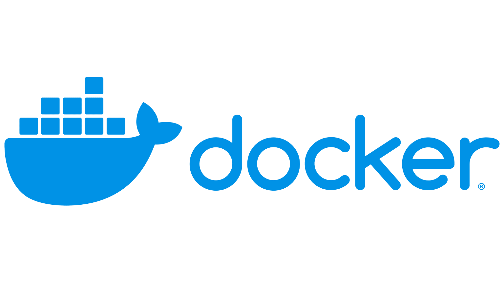

# docker-cookbook



## What is Docker?
[Docker](https://docs.docker.com/get-started/docker-overview/) is an open platform for developing, shipping, and running applications. Docker enables you to separate your applications from your infrastructure so you can deliver software quickly. With Docker, you can manage your infrastructure in the same ways you manage your applications. By taking advantage of Docker's methodologies for shipping, testing, and deploying code, you can significantly reduce the delay between writing code and running it in production.

Docker provides the ability to package and run an application in a loosely isolated environment called a container. The isolation and security lets you run many containers simultaneously on a given host. Containers are lightweight and contain everything needed to run the application, so you don't need to rely on what's installed on the host. You can share containers while you work, and be sure that everyone you share with gets the same container that works in the same way.

Docker provides tooling and a platform to manage the lifecycle of your containers:
- Develop your application and its supporting components using containers.
- The container becomes the unit for distributing and testing your application.
- When you're ready, deploy your application into your production environment, as a container or an orchestrated service. This works the same whether your production environment is a local data center, a cloud provider, or a hybrid of the two.

## How to build Docker image

To build Docker image:
```bash
docker build -t <image_name> <folder_path_with_dockerfile>
```

For example:
```bash
docker build -y my-image .
```

## Recipes
- [Dockerfile to build image for CI/CD Pipeline agents](./cicd-agent-image/)
- [Deployer image for CI/CD with Terraform, Helm, SOPS, Kubectl, Helmfile, Helmsman CLI tools and Helm plugins](./deployer/)
